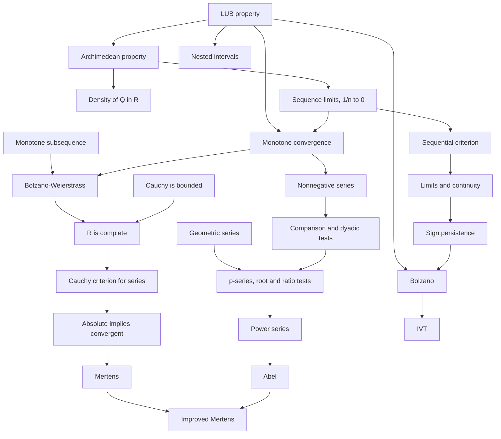

```mermaid
flowchart TD
  LUB["LUB property"] --> ARCH["Archimedean property"]
  ARCH --> DENS["Density of Q in R"]
  ARCH --> CONV["Sequence limits, 1/n to 0"]
  LUB --> NIP["Nested intervals"]
  LUB --> BMCT["Monotone convergence"]
  CONV --> BMCT
  MONO["Monotone subsequence"] --> BW["Bolzano-Weierstrass"]
  BMCT --> BW
  BW --> COMP["R is complete"]
  CB["Cauchy is bounded"] --> COMP
  COMP --> CCS["Cauchy criterion for series"]
  CCS --> ABS["Absolute implies convergent"]
  BMCT --> NN["Nonnegative series"]
  NN --> CMP["Comparison and dyadic tests"]
  GEO["Geometric series"] --> TESTS["p-series, root and ratio tests"]
  CMP --> TESTS
  TESTS --> POW["Power series"]
  ABS --> MERT["Mertens"]
  POW --> ABEL["Abel"]
  MERT --> IM["Improved Mertens"]
  ABEL --> IM
  CONV --> SEQ["Sequential criterion"]
  SEQ --> CONT["Limits and continuity"]
  CONT --> SP["Sign persistence"]
  LUB --> BOLZ["Bolzano"]
  SP --> BOLZ
  BOLZ --> IVT["IVT"]
```
